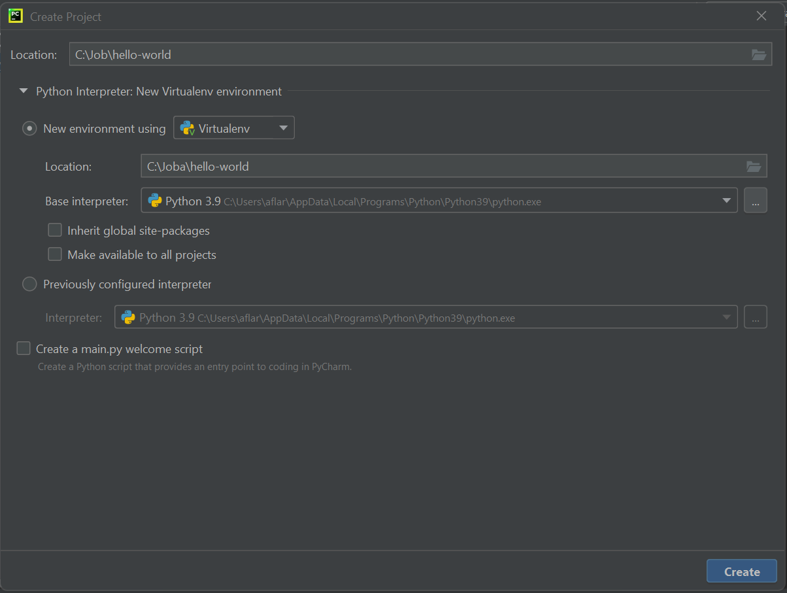
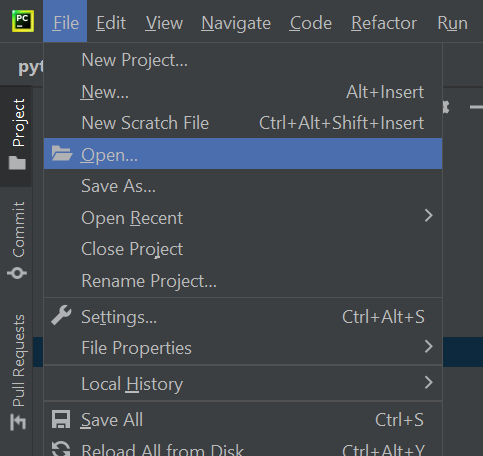
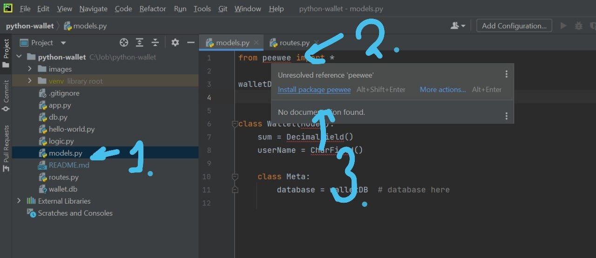
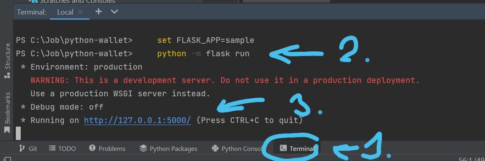

#code : python-wallet

#Demo Project: Primitive wallet

Здесь я пытаюсь описать всю ту основу,
которую нужно понимать, что начать работать:
программистом, тестировщиком, или аналитиком данных.
Все задачи основаны на реальных событиях :)

####Запуск проекта из коммандной строки:

    set FLASK_APP=sample
    python -m flask run

### Задача 1 : Hello World

1.1 Установить PyCharm [Download PyCharm](https://www.jetbrains.com/pycharm/download/download-thanks.html?platform=windows&code=PCC)

1.2 Создать проект

1.3 Создать файл hello-world.py c содержимым:
    
    print("Hello Python World!")

1.4 Запустить проект

Выбрать в меню Run > Run...

Выбрать hello-world

Видим результат: 

### Задача 2: Знакомство с проектом

2.1 Скопируй репозиторий к себе на компьютер, скачай и распакуй
   
   
2.2 Открой папку проекта
   
   
2.3 - скачай пакеты: pewee, markupsafe, flask
    
    

2.3 Запусти проект
    

    set FLASK_APP=sample
    python -m flask run

2.4 Открой браузер 
    

    Тут ты видишь список из 3ёх ссылок.
    list - выведет пользователей и их баланс
    add_user - добавит пользователя
    income - добавляет деньги на счёт пользователя

Изучи как это работает, посмотри код.

### Задача 3: Первая задача

3.1 К тебе приходит заказчик и говорит:
    - Наша система может добавлять пользователей и они могут класть деньги на счёт.
    Я хочу чтобы система не только позволяла класть деньги, но и снимать их.
    это Желание(хотелка) заказчика

3.2 Тебе нужно приобразовать это в "требования",
    задать уточняющие вопросы(задавай их мне), это могут вопросы:
    - может ли баланс быть отрицательным ? и т.д.
    Главное, чтобы через месяц заказчик не пришел и не сказал: я такого не говорил делать!
    Придумать 1-5 вопросов и задай их мне. Можешь сам придумать ответы.

3.3 Теперь тебе надо составить "техническое задание"
3.3.1 Описать пользовательский интерфейс
--- в разработке ---
3.3.2 Описать модель данных
--- в разработке ---
3.3.3 Описать алгоритм нового сервиса
--- в разработке ---

3.4 Передай мне тех задание, и мы вместе реализуем задачу.
Так ты узнаешь что такое данные, алгоритмы...
--- в разработке ---