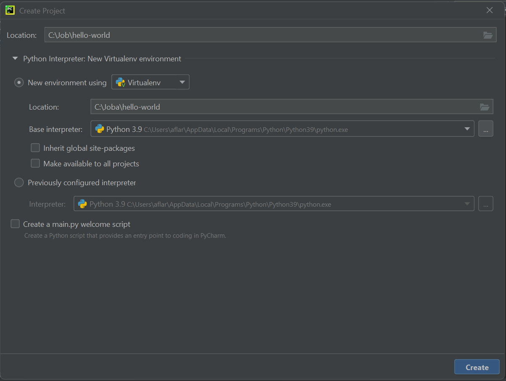
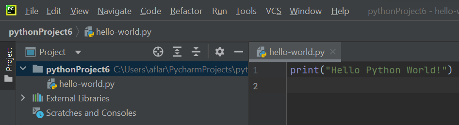
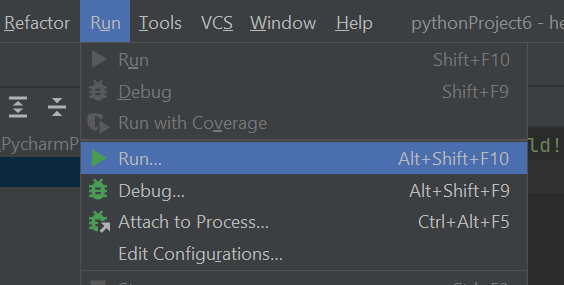
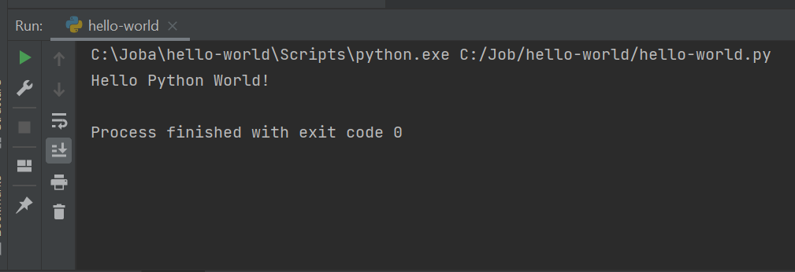

###### Задача №1

### Python Hello World

Сделаем первое простое приложение, выводит строку "Hello World".

1. Скачай и
   установи [PyCharm](https://www.jetbrains.com/pycharm/download/download-thanks.html?platform=windows&code=PCC)

2. Создай проект:
   

3. Создай файл hello-world.py c содержимым:

[пример тут](/hello-world.py)

    `print("Hello Python World!")`

4. Запусти проект:

Выбери в меню Run > Run...

Выбери hello-world

Проверь результат:
