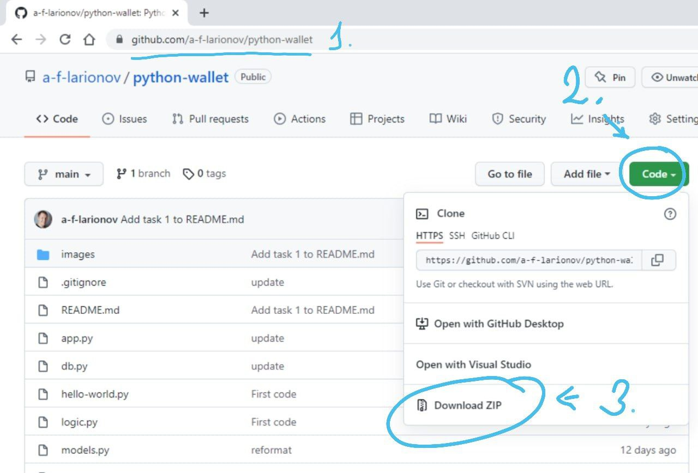
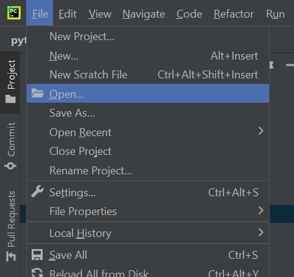
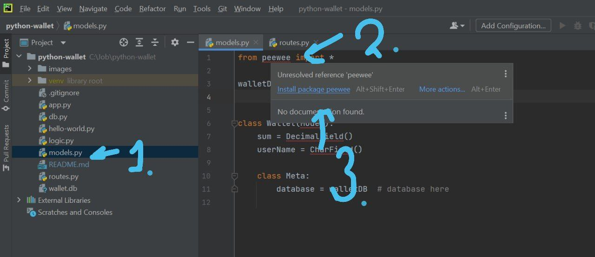
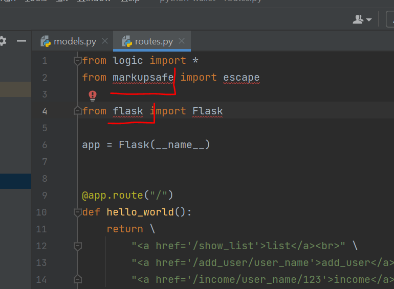
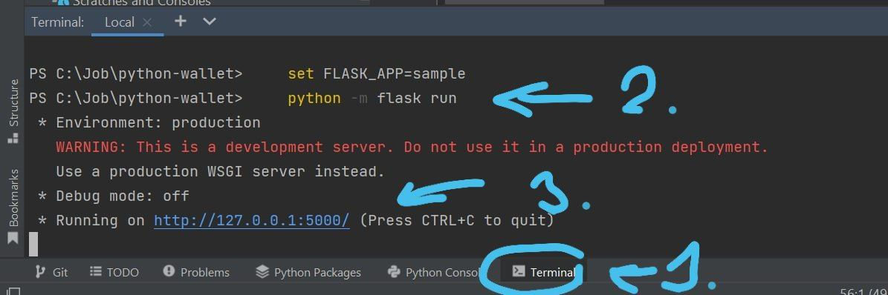
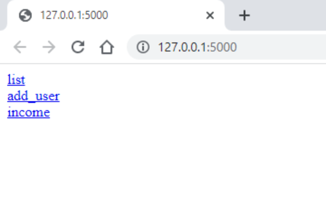

###### Задача 2

### Знакомство с проектом

Когда начинаешь работать в ИТ, на работе, тебя сначала знакомят с проектом.

1. Скопируй репозиторий к себе на компьютер, скачай и распакуй:
   
2. Открой папку проекта:
   
3. Скачай пакеты: pewee, markupsafe, flask:
   Надо открыть файлы: models.py и app.py(старое: routes.py)
   и навести мышку на название пакетов, всплывет окно, там нажми "Install package"
   
   

4. Запусти проект:

   set FLASK_APP=sample python -m flask run

5. Открой браузер:
   

Тут ты видишь список из 3ёх ссылок:

- list - выведет пользователей и их баланс
- user_add - добавит пользователя
- income - добавляет деньги на счёт пользователя

6. Изучи как это работает, посмотри код.